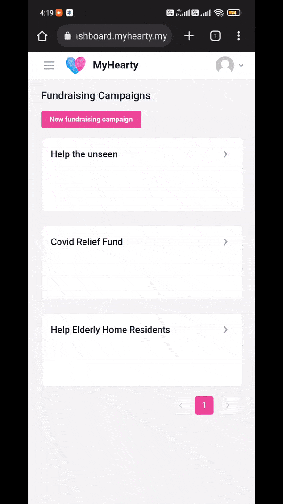

<div align="center">
  <a href="https://github.com/myhearty-org/myhearty">
    
  </a>
  <h2 align="center">MyHearty</h2>
  <p align="center">
    A one-stop charity website to fundraise, donate, volunteer and apply for aids
    <br />
    <br />
    <a href="https://www.myhearty.my">Website</a>
    ·
    <a href="https://dashboard.myhearty.my">Dashboard</a>
  </p>
</div>

---

## About The Project

MyHearty is a one-stop, centralized charity website for people to fundraise, donate, volunteer and apply for aids. The motivation behind this project stems from the idea of integrating fundraising, donation, volunteering and aiding functions into a single platform with API access. This project aims to connect various parties that are involved in charity via a centralized platform and provide open charity data via an API.

### Features

- [x] Full-featured search UI (instant search, geosearch) for campaigns, volunteer events and aids
- [x] Fundraising and donations
- [x] Volunteering
- [x] Receiving aids
- [x] Managing organization/charity members
- [ ] API access

### MyHearty Website Demo

<table style="table-layout:fixed; white-space: nowrap;">
  <tr>
    <td></td>
    <td></td>
  </tr>
</table>

### MyHearty Dashboard Demo

<table style="table-layout:fixed; white-space: nowrap;">
  <tr>
    <td></td>
    <td></td>
  </tr>
</table>

### Built With

- [Next.js](https://nextjs.org)
- [React](https://reactjs.org)
- [Tailwind CSS](https://tailwindcss.com)
- [Mantine](https://mantine.dev)
- [React InstantSearch](https://github.com/algolia/react-instantsearch)
- [Typesense](https://typesense.org)
- [Stripe Checkout](https://stripe.com/docs/payments/checkout)
- [SWR](https://swr.vercel.app)

## Development

To get a local copy up and running, read the following subsections.

### Requirements

You need the following requirements to be able to run MyHearty locally.

- Node.js (Version: >=16.x)
- Yarn (_recommended_)

> **Note** <br />
> If you want to enable any of the available integrations, you may want to obtain additional credentials and populate environment variables for the corresponding integration. Refer to the [integrations section](#integrations) for more details.

### Project Structure

This project is a Next.js monorepo that consists of 2 apps: MyHearty website and MyHearty dashboard. The detailed directory structure is shown below.

```
.
├── apps
│   ├── dashboard (MyHearty dashboard)
│   └── web       (MyHearty website)
├── packages
│   ├── hooks     (shared utility and query hooks)
│   ├── lib       (API client functions, shared constants and types)
│   ├── ui        (shared UI components)
│   └── utils     (shared utility functions)
└── static        (common assets: favicons, images, locales)
```

> **Note** <br />
> Assets inside the `static/` directory will be symlinked to `public/` directories of both apps. Hence, you only need to add assets to the `static/` directory once and they will be available for both apps. During deployment, the symlinks will be removed and the assets will be copied from the `static/` directory to each app's `public/` directory. Refer to `apps/**/package.json` for more detail.

### Getting Started

1. Clone the repo.
   ```sh
   git clone https://github.com/myhearty-org/myhearty.git
   ```
2. Install dependencies with Yarn.
   ```sh
   yarn install
   ```
4. To run MyHearty website:
   - Create a `.env.local` file inside the `apps/web/` directory by copying the environment variables from the [`.env.example`](./apps/web/.env.example) file. For more information on populating environment variables, refer to the [integrations section](#integrations).
   - Run
     ```sh
     cd apps/web
     yarn dev
     ```
     Go to [http://localhost:3001](http://localhost:3001) to view the website.
5. To run MyHearty dashboard:
   - Create a `.env.local` file inside the `apps/dashboard/` directory by copying the environment variables from the [`.env.example`](./apps/dashboard/.env.example) file. For more information on populating environment variables, refer to the [integrations section](#integrations).
   - Run 
     ```sh
     cd apps/dashboard
     yarn dev
     ```
     Go to [http://localhost:3002](http://localhost:3002) to view the dashboard.

## Integrations

### MyHearty Backend API

A running local MyHearty API server is required to serve the content for both frontend website and dashboard. To integrate with the frontend apps:

1. Refer to the [myhearty-api](https://github.com/myhearty-org/myhearty-api) repository to learn how to set up a local API server. The API server should be running on port `3000`.
2. In the `apps/web/.env.local` and `apps/dashboard/.env.local` files, assign `http://localhost:3000` to the `NEXT_PUBLIC_API_URL` variables.

### Typesense

[Typesense](https://typesense.org) is an open-source, typo-tolerant search engine that is optimized for instant search. It is an easier-to-use alternative for commercial search API like Algolia, which has high pricing, or open-source search engine like Elasticsearch, which can be complicated to tune. To enable the website's instant search feature:

1. Ensure that a Typesense instance has been running on your local API server. Refer to [MyHearty Backend API section](#myhearty-backend-api) for more detail.
2. Create a search-only API key using your admin key with the following curl command:
   ```curlrc
   curl 'http://localhost:8108/keys' \
    -X POST \
    -H "X-TYPESENSE-API-KEY: ${TYPESENSE_API_KEY}" \
    -H 'Content-Type: application/json' \
    -d '{"description": "Search-only API key.", "actions": ["documents:search"], "collections": ["organizations", "fundraising_campaigns", "volunteer_events", "charitable_aids"]}'
   ```
   Refer to [Typesense: Create an API key](https://typesense.org/docs/0.23.1/api/api-keys.html#create-an-api-key) for more detail.
3. In the `apps/web/.env.local` file, populate the Typsense's related environment variables:
   ```sh
   NEXT_PUBLIC_TYPESENSE_HOST='localhost' # if the Typesense instance is running on your local API server
   NEXT_PUBLIC_TYPESENSE_PORT=8108 # default port on which Typesense is running
   NEXT_PUBLIC_TYPESENSE_PROTOCOL='http' # can be http or https
   NEXT_PUBLIC_TYPESENSE_API_KEY='' # your search-only API key
   ```
   You can replace the defaults with other values for your own changes.

### Geoapify

[Geoapify](https://www.geoapify.com) provides the [Address Autocomplete API](https://www.geoapify.com/address-autocomplete) that is required for the website's geosearch feature. To enable the website's geosearch feature:

1. Go to [Geoapify MyProjects](https://myprojects.geoapify.com/login) to create an account and generate an API key for your project.
2. In the `apps/web/.env.local` file, populate the `NEXT_PUBLIC_GEOAPIFY_API_KEY` variable with your Geoapify API key.

## Documentation

The full documentation for the MyHearty project can be found in the [myhearty-documentation](https://github.com/myhearty-org/myhearty-documentation) repository. The documentation repository contains technical documents and architecture information related to the implementation of this project.

## Contributing

If you want to contribute, please fork the repo and create a pull request by following the steps below:

1. Fork the repo.
2. Create your feature branch (`git checkout -b your-feature-branch`).
3. Commit your changes and push to the branch (`git push origin your-feature-branch`).
5. Open a pull request.

Your changes will be reviewed and merged if appropriate.

## References

- [GitHub: Next.js Monorepo Template](https://github.com/belgattitude/nextjs-monorepo-example)
- [GitHub: Instant E-Commerce Store Experience, powered by Typesense + Next.js](https://github.com/typesense/showcase-nextjs-typesense-ecommerce-store)
- [Geoapify: Get started with Maps API](https://www.geoapify.com/get-started-with-maps-api)
- [Stripe Checkout: Quickstart](https://stripe.com/docs/checkout/quickstart)
- [SWR Docs: Getting Started](https://swr.vercel.app/docs/getting-started)
